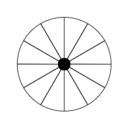

# 什么是线性代数？

说来惭愧，我是到了研究生阶段开始自学抽象代数，才明明白白搞清楚什么是线性，什么是代数。我问过不少身边的同学，问他们你知道什么是线性吗？大家都只是有一个感性的认知，没有一位同学能清除地说出线性的定义，更不要说代数了。

但这不怪我们，当初在学「线性代数」的时候，老师并没有强调这部分的内容，甚至都不会讲。但我觉得这是非常重要的，因为搞清楚了线性和代数的概念，才知道学的究竟是什么，能够用在哪里。

或许在很多同学眼里，尤其是工科的同学，对待基础学科（甚至是部分专业学科）的态度就是“会用就行了”。但是无论你想要做进一步的科研，或者仅仅是让自己学得更扎实、考试成绩更好，掌握这些基础概念都有助于让你拥有更加透彻与敏锐的直觉。

## 1. 代数

我们先来介绍一下代数是什么？在维基百科中，代数有这样的定义

> Algebra is the study of variables and the rules for manipulating these variables in formulas.

即，代数研究的是**变量**以及**公式中操作变量的规则**。

不难发现，代数是一个非常宽泛的概念，只要涉及到**变量**都可以称之为代数。而初等代数早在小学就已经开始学习了，比如一元一次方程：

$$
x + 1 = 2
$$

区别于算术，代数中用字母（或者其他符号）来表示一个数，关注的重点也从数与数之间的运算转移到了变量所属集合以及相关问题的整体性质。比如解决二元一次方程的消元法，或者一元二次方程的求根公式，等等。

但代数的研究并不仅仅局限于此，今天我们介绍的「线性代数」就是其一，此外还有「抽象代数」、「交换代数」、「代数几何」等等。在这些学科中，代数不再是简单的“代替数字”，而是更加抽象的对象，比如向量、矩阵、群、环、域等等。

总而言之，代数是通过用变量来表示数学对象，从而研究这些对象之间的关系的学科。那么「线性代数」中研究的数学对象是什么呢？这就要需要介绍一下什么是线性了。

## 2. 线性

提到线性，大家第一反应可能是“直线”，类似于这样的函数$y = k x +b$，但二次函数$y=ax^{2}+bx+c$就不是线性的。那么两者的区别在哪里呢？

首先，这里我们说的线性实际上是指**线性函数**，即函数$f$满足：

$$
    \begin{split}
        & f(x+y) = f(x) + f(y) \\
        & f(ax) = af(x)
    \end{split}
$$

这里的$x$和$y$是函数的自变量，$a$是一个常数。根据这个定义，我们所熟悉的直线表达式$y=kx+b$并不是一个线性函数，显然

$$
    \begin{split}
        & f(x+y) = k(x+y) + b \neq kx + ky + 2b = f(x) + f(y) \\
        & f(ax) = kax + b \neq akx + ab = af(x)
    \end{split}
$$

不过，过原点的直线$y=kx$就是一个线性函数，这很容易验证。从线性函数的定义出发，可以发现**线性**包括两个核心性质，一个是关于加法的，一个是关于数乘的。而「线性代数」中的线性，同样是关于加法和数乘的性质，当然最终要落实到具体的数学对象上，我们才能给出「线性代数」中线性的定义。

### 2.1. 线性空间

「线性代数」主要研究的数学对象是**线性空间**，而所谓空间指的就是一个集合。对于一个线性空间$V$，其具有加法运算和数乘运算，设有线性空间中的两个元素$x,y \in V$，那么这两个运算满足：

$$
    \begin{split}
        & x + y \in V \\
        & \alpha x \in V
    \end{split}
$$

其中，$\alpha$是一个常数。上面的公式则表明，对于线性空间中任意两个元素，两者之和依旧是线性空间中的元素；对于线性空间中的一个元素，它与任意一个常数的乘积依旧是线性空间中的元素，换而言之**线性空间**是可以相加和缩放的。除了这两个性质之外，线性空间还需要满足其他性质，诸如加法交换律、结合律、数乘结合律、分配律等等，这里就不再赘述了。

需要注意的是，定义中涉及到了一个常数 $\alpha$ ，如果 $\alpha$ 任意的实数，那么我们称这个线性空间为**实数域上的线性空间**，如果$\alpha$任意的复数，那么我们称这个线性空间为**复数域上的线性空间**。

我们所熟悉的实数集、复数集本身就是线性空间，但整数集就不是**实数域**上的线性空间，因为尽管任意两个整数的和依旧是整数，但整数乘一个实数不一定是整数。

### 2.2. 线性变换

前面提到过代数不仅仅研究数学对象，还研究对象之间的关系。在「线性代数」中，最主要的研究内容便是**线性变换**，即一个线性空间到另一个线性空间的映射。设有两个线性空间$V$和$W$，则线性变换$T$可以将$V$中的元素映射到$W$中的元素，即$x \in V$那么$T(x) \in W$，并且映射满足如下性质

$$
    \begin{split}
        & T(x + y) = T(x) + T(y) \\
        & T(\alpha x) = \alpha T(x)
    \end{split}
$$

如果对比线性函数的定义，不难发现线性变换和线性函数的定义有着非常接近的形式。这并不是什么巧合，而是因为线性函数本就是线性变换的一种特殊情况。前面我们提到过，实数集可以看作是实数域上的一个线性空间。而实数集上的一个线性函数 $f(x)$ 则可以看作从实数集到实数集的一个映射，所以线性函数 $f(x)$ 是一个线性变换。

但线性空间不仅仅局限于实数集，自然地线性变换也不只有着$f(x) = kx$这样的形式，更多的内容就留到后面的章节中介绍了。

## 3. 小结

线性代数指的是用代数的方法研究线性空间以及线性变换的学科。而线性是关于加法和数乘的性质，具体到不同的数学对象上则有不同的定义。此外，线性是最基本也是最简单的性质，正是因为基础和简单，所以线性广泛地存在于这个自然界中。因此，学好线性代数，我们就有了一个趁手的工具，这个工具能够解决我们所遇到的问题中相当大的一部分。

## 4. 后记

最基础的最有生命力，同学们对这句话或多或少都有一些体会，但我仍然想将一个有趣的例子进一步佐证它。大家都知道在陆地上运动最简单的结构就是轮子，或者说一个圆。人类发明的各种交通工具，比如自行车、汽车、火车等等，都是用轮子作为基本的运动结构。但是没有哪个生物说长了个轮子，每天在地上滚来滚去。这是因为轮子需要一个可以活动的轴，生命是很难演化出这样的结构的。这是否意味着，最基础的最有生命力这句话并不成立呢？

答案当然是否定的，有的时候一个结构可能看起来很复杂，但往往是依照着最简单的原理来运行的。下面，我就来展示一下，人类使用双腿行走和轮子滚动之间有什么样的相似之处。

一般来说，一个车轮的最外一圈叫做**辋**，支撑辋的长条形结构叫做**辐条**，辐条与辐条之间用**轮毂**连接。我们可以将辐条看作是车轮的骨架，而辋则是骨架的外壳。如果我们去掉辋，那么车轮和底面接触的就是辐条了，当辐条够密的时候，还是车轮还是可以勉强滚动的，只不过不够圆滑而已。

  

    

      
      (a) 
    

    

      
      (b) 
    

  

   图1. 轮子的近似 (a) 一个车轮 (b) 去除辋的轮子

如果，我们只保留两根辐条，那么在滚动过程中（逆时针），就会出现跟不上的情况，因为原本应该出现在左侧的辐条被去掉了。这时该怎么办呢？我们可以将已经滚过去的辐条（右侧的辐条）拆下来，装到左侧，这样就可以保证轮子的运动。

  

    

      
      (a) 
    

    

      
      (b) 
    

    

      
      (c) 
    

  

    图2. 两个辐条的轮子的滚动过程 (a) 两个辐条的轮子 (b) 辐条缺失无法继续滚动 (c) 移动辐条

如果我们将这两个辐条看作是人的左右腿，那么走路的过程就可以看作是上面所说的一个只有两个辐条的轮子的滚动过程。我们首先迈出左腿，此时对应图 2.a；当我们的左脚落地，整个人开始前倾时，右腿会处于整个身体的后方，此时对应图 2.b；此时急需将落在后方的“辐条”移动到前方去，于是我们会抬起右腿，迈出下一步，此时对应图 2.c。如此循环往复，从而让我们能够不断的前进。

因此，用双腿行走的基本原理等价于图 1.b 中去掉辋的轮子的滚动，而去掉辋的轮子的滚动实际上是一个轮子（圆）的滚动的近似。

最基础的最有生命力，但事物往往并不会以简单的形式出现。想要洞察事物的本质，就是需要我们有敏锐的观察力与直觉，而这往往是从对基础概念的思考中培养出来的。
