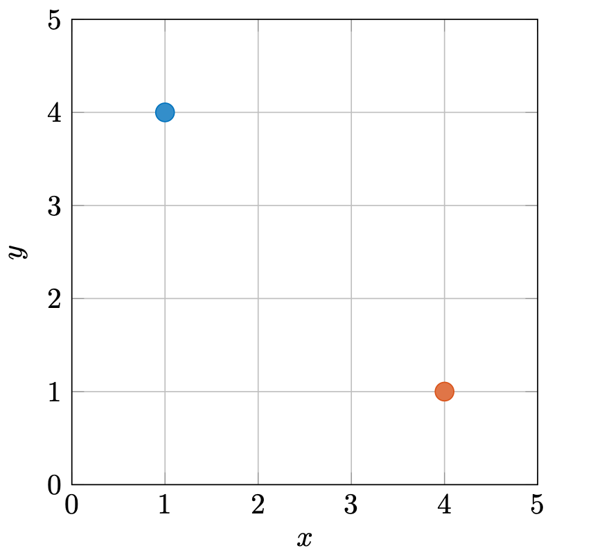

# 线性空间

线性空间，又称作向量空间，是线性代数中最核心的内容之一。如果将线性代数看作是一个像围棋那样的游戏，那么线性空间就可以看作是棋盘。线性空间圈定了游戏的场地，一切的游戏规则都只在这个场地内有效。因此，了解线性空间并熟练掌握其基本性质是学习线性代数的基础，否则后续学到的任何知识都将是空中楼阁。

## 1. 定义

首先我们要明确的是，线性空间是一个集合，一个满足特定性质的集合。在上一篇文章中已经给出了最重要的两个性质，也就是关于加法和数乘的封闭性。

设有集合$V$，$V$中的元素满足以下两个性质：

$$
    x + y \in V, \forall x, y \in V \\
    \alpha x \in V, \forall x \in V, \alpha \in \mathbb{R}
$$

即，对于集合$V$中的任意两个元素$x$和$y$，它们的和$x+y$属于集合$V$；对于集合$V$中的任意一个元素$x$，它与任意一个实数（也可以是复数，不过方便起见，只讨论实数的情况）的乘积$\alpha x$也属于集合$V$。此外，如果集合$V$还满足下面的性质：

> 1. 单位元：存在一个元素$e \in V$，使得对于任意一个元素$x \in V$，都有$x + e = x$，我们称这个元素$e$为集合$V$的单位元
> 1. 逆元： 对于任意一个元素$x \in V$，都存在一个元素$-x \in V$，使得$x + (-x) = e$，我们称这个元素$-x$为元素$x$的逆元素。
> 1. 结合律： 对于集合$V$中的任意三个元素$x, y, z$，都有$(x + y) + z = x + (y + z)$。
> 1. 交换律： 对于集合$V$中的任意两个元素$x, y$，都有$x + y = y + x$。
> 1. 乘法单位元：对于集合$V$中的任意一个元素$x$，都有$1 \cdot x = x$。
> 1. 加法分配律：对于集合$V$中的任意两个元素$x, y$，都有$\alpha (x + y) = \alpha x + \alpha y$。
> 1. 数乘分配律：对于集合$V$中的任意一个元素$x$，都有$(\alpha + \beta) x = \alpha x + \beta x$。
> 1. 数乘结合律：对于集合$V$中的任意一个元素$x$，都有$(\alpha \beta) x = \alpha (\beta x)$。

那么我们称集合$V$是一个**实数域上的线性空间**，简称**实线性空间**。 可以看到，性质很多，但每一个性质都是必要的。下面我们来举几个例子，加深一下理解。

### 1.1. 例子

1.  二维平面上的所有可能的坐标$\begin{bmatrix} x_{1} & x_{2} \end{bmatrix}$构成的集合

    $$
        V = \left\{ \begin{bmatrix} x_{1} & x_{2} \end{bmatrix} | x_{1}, x_{2} \in \mathbb{R} \right\}.
    $$

    如果我们定义加法和数乘运算如下：

    $$
        \begin{split}
            & \begin{bmatrix} x_{1} & x_{2} \end{bmatrix} + \begin{bmatrix} y_{1} & y_{2} \end{bmatrix} = \begin{bmatrix} x_{1} + y_{1} & x_{2} + y_{2} \end{bmatrix}, \\
            & \alpha \begin{bmatrix} x_{1} & x_{2} \end{bmatrix} = \begin{bmatrix} \alpha x_{1} & \alpha x_{2} \end{bmatrix}.
        \end{split}
    $$

    那么，$V$是一个实数域上的线性空间，这很容易验证。

1.  二维平面上的所有可能的坐标$\begin{bmatrix} x_{1} & x_{2} \end{bmatrix}$构成的集合

    $$
        V = \left\{ \begin{bmatrix} x_{1} & x_{2} \end{bmatrix} | x_{1}, x_{2} \in \mathbb{R} \right\}.
    $$

    如果我们定义加法和数乘运算如下：

    $$
        \begin{split}
            & \begin{bmatrix} x_{1} & x_{2} \end{bmatrix} + \begin{bmatrix} y_{1} & y_{2} \end{bmatrix} = \begin{bmatrix} x_{1} + y_{2} & x_{2} + y_{1} \end{bmatrix}, \\
            & \alpha \begin{bmatrix} x_{1} & x_{2} \end{bmatrix} = \begin{bmatrix} \alpha x_{1} & \alpha x_{2} \end{bmatrix}.
        \end{split}
    $$

    那么，$V$不是一个实数域上的线性空间，因为加法不满足交换律：

    $$
        \begin{bmatrix} x_{1} & x_{2} \end{bmatrix} + \begin{bmatrix} y_{1} & y_{2} \end{bmatrix} = \begin{bmatrix} x_{1} + y_{2} & x_{2} + y_{1} \end{bmatrix} \neq \begin{bmatrix} y_{1} + x_{2} & y_{2} + x_{1} \end{bmatrix} = \begin{bmatrix} y_{1} & y_{2} \end{bmatrix} + \begin{bmatrix} x_{1} & x_{2} \end{bmatrix}.
    $$

1.  有两个元素的集合$\{ 0, 1 \}$，其中的加法和数乘运算与 2 中的定义相同。显然这个集合不是一个实数域上的线性空间，因为

    $$
        1 + 1 = 2 \notin \{ 0, 1 \},
    $$

    即不满足加法封闭性，当然了，也不满足乘法封闭性。

1.  二维平面上的沿着原点的旋转操作构成的集合$V = \{ r_{\theta} | 0 \leq \theta <360 \}$，定义加法和数乘运算如下：

    $r_{\theta} + r_{\phi}$表示先旋转$\theta$度，再旋转$\phi$度；$\alpha r_{\theta}$表示旋转$\alpha\theta$度后再缩放$\alpha$倍。

    显然，我们有

    $$
        \begin{split}
            & r_{\theta} + r_{\phi} = r_{mod(\theta + \phi, 360)} \\
            & \alpha r_{\theta} = r_{\alpha \theta}
        \end{split}
    $$

    很容易验证，集合关于加法和数乘运算满足封闭性，进一步去验证那八条运算性质，可以发现平面上的旋转操作构成了一个实数域上的线性空间。

    可以看到线性空间的形式非常多样，只要满足线性空间的定义，那么就是一个线性空间。但最常见到的线性空间就是由向量构成的空间，比如上面的例子 1。

## 2. 向量空间

直角坐标系中的某个点的坐标可以用有序的数列来表示，比如图 1 中蓝色点的坐标为(1, 4)，红色点坐标为(4, 1)。正是因为这个序列是有序的，所以蓝色的点和红色点并不是同一个点。

    <figure style="text-align:center;margin-right:30px;">
        
        <figcaption> 图1. 坐标是有序的数列 </figcaption>
    </figure>

通常来说，我们可以用用一个向量来表示一个点的坐标。比如图 1 中的蓝色点可以用向量 $\begin{bmatrix} 1 & 4 \end{bmatrix}$来表示，红色点可以用向量$\begin{bmatrix} 4 & 1 \end{bmatrix}$ 来表示。当然，向量不仅仅可以横着写，也可以竖着写：

$$
    \boldsymbol{u} = \begin{bmatrix} u_{1} \\ u_{2}  \\ \vdots \\ u_{n} \end{bmatrix}, \quad \boldsymbol{v} = \begin{bmatrix} v_{1} & v_{2} & \cdots & v_{n} \end{bmatrix},
$$

其中 $\boldsymbol{u}$ 被称作列向量，$\boldsymbol{v}$ 被称作行向量。此外，我们通常用一个斜体加粗的字母来表示向量，比如 $\boldsymbol{u}$，$\boldsymbol{v}$，$\boldsymbol{x}$，$\boldsymbol{y}$ 等等。并且，如果不特别说明，向量都是列向量。行向量和列向量之间可以通过转置运算$*^{\mathrm{T}}$相互转换，比如

$$
    \boldsymbol{u} = \begin{bmatrix} u_{1} \\ u_{2}  \\ \vdots \\ u_{n} \end{bmatrix} = \begin{bmatrix} u_{1} & u_{2} & \cdots & u_{n} \end{bmatrix}^{\mathrm{T}}.
$$

一个向量的维度是指向量中元素的个数，比如向量 $\boldsymbol{u}, \boldsymbol{v}$ 都是 $n$ 维向量。而给定维度 $n$，所有 $n$ 维向量构成的集合被称作$n$维向量空间，记作 $\mathbb{R}^{n}$ 。比如图 1 中的点的坐标都是二维向量，所以它们都属于二维向量空间 $\mathbb{R}^{2}$。

线性空间又被称作向量空间，这是有原因的。在上一小节中，我们给出了各种形式的线性的空间，但这些线性空间都同构于向量空间。同构是抽象代数中的一个概念，大家可以暂时理解成“具有相同的结构”。这意味着，上一小节中给出的线性空间中的元素都可以用一个向量来表示。因此，我们只需要研究向量空间就足够了。

## 3. 习题

1.  只有一个元素的集合$\{ 0 \}$，是否是一个线性空间？
2.  三维空间上的旋转操作构成的集合，是否是一个线性空间？
3.  所有周期为$T$的实函数构成的集合，是否是一个线性空间？

## 4. 后记

看到线性空间的定义，大家可能会觉得繁琐，除了最重要两条性质外，还有额外的八条性质，但每一条都是必不可少的。为了让大家更好地体会定义的重要性，我来讲一个关于集合的故事。

什么是集合呢？集合的定义是什么？就朴素的理解而言，集合就是一系列事物的总体。集合中的事物可以是任何对象，数字、符号、点、线、面、甚至集合，都可以是集合中的元素。

那么有一个问题来了，一个集合$X$可不可以包括自身呢，也就是

$$
    X \in X,
$$

是否能够成立。如果我们认为是可以成立的，也就是一个集合能够包括自身，那么显然我们可以将所有的集合分为两类，一类包括自身、一类不包括自身，将这两类集合的集合分别记作 $A$ 和 $B$。

1. 如果一个集合 $X$ 是 $A$ 中一个元素 $X \in A$，那么这个集合就包括自身，也就是 $X \in X$
2. 如果一个集合 $X$ 是 $B$ 中一个元素 $X \in B$，那么这个集合就不包括自身，也就是 $X \notin X$。

并且，不存在一个集合既包括自身也不包括自身，所以我们有

$$
    A \cap B = \emptyset.
$$

下面我们来考察一下 $B$ 这个集合，首先由于 $A \cap B = \emptyset$ 所以 $B \notin A$，也就是说 $B$ 不包括自身，所以 $B \notin B$。但是，如果 $B$不包含自身，那么显然本身 $B$ 就是应该是 $B$ 中的一个元素，也就是 $B \in B$，这就产生了矛盾。

这便是著名的“罗素悖论”，在这之前数学家们认为“一切数学成果可建立在集合论基础上”，而“罗素悖论”出现引发了第三次数学危机。最终，公理化集合论的建立，成功排除了集合论中出现的悖论，从而比较圆满地解决了这次危机。

具体而言，新的定义中要求一个集合**不能包括自身**，从而避免矛盾的出现。

“罗素悖论”更常见的形式是“理发师悖论”：一个理发师只给那些不给自己理发的人理发，那么这个理发师给自己理发吗？

之所以要专门花篇幅讲“罗素悖论”，是想让大家明白定义的重要性，可以说定义是一个数学概念的骨架，是一个数学概念的灵魂。定义中的每一句话都不可或缺，不妨思考一下先贤们究竟是出于什么样的考虑才保留下相关的语句，这会让我们对数学概念有更深层次且更精确的理解。
