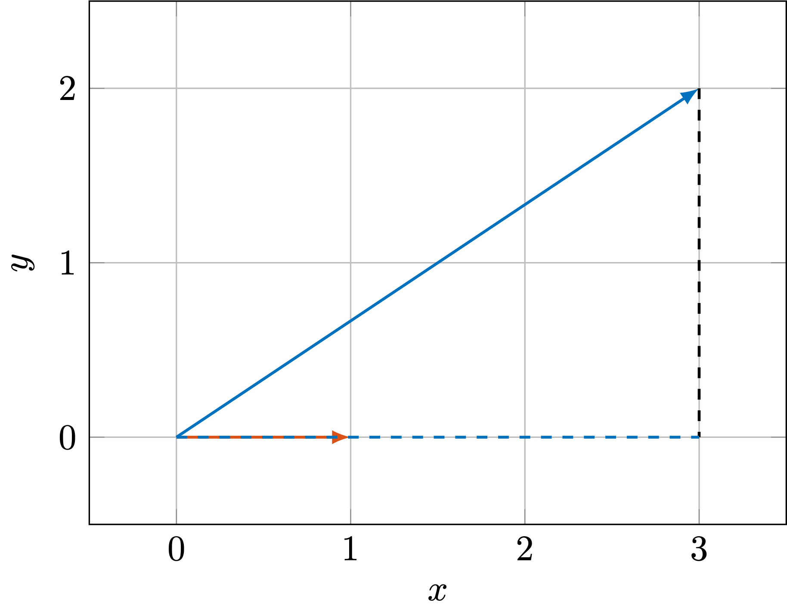
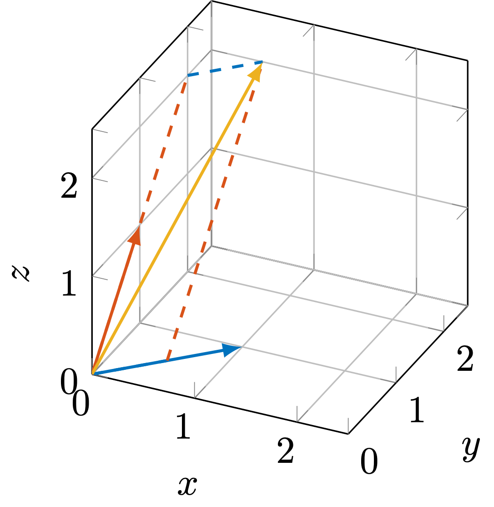

# 向量的基本运算

向量是向量空间中的一个元素，除了最基本的加法和数乘运算外，还有一些其他的运算。当然，正如向量空间有着明确的几何意义一样（比如二维向量空间是一个平面），这些运算我们同样也可以从几何的角度来理解。

当然，在介绍这些运算之前，我们先来回顾一下向量最基本的加法和数乘运算。设向量 $\boldsymbol{x},\boldsymbol{y}$ 都为 $n$ 维向量空间 $V$ 中的元素，那么向量的加法运算定义为：

$$
\boldsymbol{x} + \boldsymbol{y} = \begin{bmatrix} x_{1} \\ x_{2} \\ \vdots \\ x_{n} \end{bmatrix} + \begin{bmatrix} y_{1} \\ y_{2} \\ \vdots \\ y_{n} \end{bmatrix} = \begin{bmatrix} x_{1} + y_{1} \\ x_{2} + y_{2} \\ \vdots \\ x_{n} + y_{n} \end{bmatrix}
$$

设 $\alpha$ 为实数，那么向量的数乘运算定义为：

$$
\alpha \boldsymbol{x} = \alpha \begin{bmatrix} x_{1} \\ x_{2} \\ \vdots \\ x_{n} \end{bmatrix} = \begin{bmatrix} \alpha x_{1} \\ \alpha x_{2} \\ \vdots \\ \alpha x_{n} \end{bmatrix}
$$

## 向量的内积

内积是向量空间中最基本的运算之一，它不仅可以用来定义向量的长度，还可以用来定义向量之间的夹角。我们首先给出内积的定义。

> 给定两个 $n$ 维向量 $\boldsymbol{x}, \boldsymbol{y}$，它们的内积定义为：
>
> $$
> \langle \boldsymbol{x}, \boldsymbol{y} \rangle  = x_{1} y_{1} + x_{2} y_{2} + \cdots + x_{n} y_{n} = \sum_{i=1}^{n} x_{i} y_{i}.
> $$

简单来说，就是将两个向量对应位置的元素相乘，然后再将所有的乘积相加。并且，我们可以发现，内积满足如下性质：

$$
    \langle \boldsymbol{x}, \boldsymbol{y} + \boldsymbol{z} \rangle = \langle \boldsymbol{x}, \boldsymbol{y} \rangle + \langle \boldsymbol{x}, \boldsymbol{z} \rangle.
$$

那么，在给定内积的定义后，我们就可以进一步地给出向量的模长的计算公式：

$$
    \|x\|^{2} = \langle \boldsymbol{x}, \boldsymbol{x} \rangle = x_{1}^{2} + x_{2}^{2} + \cdots + x_{n}^{2}.
$$

换句话说就是，一个向量的模长的平方等于这个向量与自身的内积。

接下来，我们需要回忆一下三角形余弦公式：

$$
    \|\boldsymbol{c}\|^{2} = \|\boldsymbol{a} - \boldsymbol{b}\|^{2} = \|\boldsymbol{a}\|^{2}  + \|\boldsymbol{b}\|^{2} - 2 \|\boldsymbol{a}\| \|\boldsymbol{b}\| \cos \theta,
$$

其中 $\boldsymbol{a}, \boldsymbol{b}, \boldsymbol{c}$ 为三角形三个边，而$\theta$ 为 $\boldsymbol{a}$ 与 $\boldsymbol{b}$ 的夹角。

与此同时，根据模长的计算公式，我们有

$$
\begin{split}
        \|\boldsymbol{a} - \boldsymbol{b}\|^{2} & = \langle \boldsymbol{a} - \boldsymbol{b}, \boldsymbol{a} - \boldsymbol{b} \rangle \\
        & = \langle \boldsymbol{a}, \boldsymbol{a} \rangle + \langle \boldsymbol{b}, \boldsymbol{b} \rangle - 2 \langle \boldsymbol{a}, \boldsymbol{b} \rangle \\
        & = \|\boldsymbol{a}\|^{2} + \|\boldsymbol{b}\|^{2} - 2 \langle \boldsymbol{a}, \boldsymbol{b} \rangle.
\end{split}
$$

对比上面两个公式，我们可以发现，两个向量之间的内积与它们的模长以及夹角之间存在着如下关系：

$$
    \langle \boldsymbol{a}, \boldsymbol{b} \rangle = \|\boldsymbol{a}\| \|\boldsymbol{b}\| \cos \theta.
$$

因此，两个向量之间的夹角可以通过如下公式计算：

$$
    \cos \theta = \frac{\langle \boldsymbol{a}, \boldsymbol{b} \rangle}{\|\boldsymbol{a}\| \|\boldsymbol{b}\|}.
$$

如此一来，向量的内积的几何意义就非常清晰了。不妨令向量 $\boldsymbol{b}$ 的模长为 1，那么向量 $\boldsymbol{a}$ 在向量 $\boldsymbol{b}$ 上的投影长度就是 $\|\boldsymbol{a}\| \cos \theta$，而这就刚好等于 $\langle \boldsymbol{a}, \boldsymbol{b} \rangle$。

    <figure style="text-align:center;margin-right:30px;">
        
        <figcaption> 图1. 向量内积 </figcaption>
    </figure>

## 向量的线性组合

由于线性空间是加法和数乘封闭的，因此我们自然很关心多个向量以及他们的组合之间有什么联系。首先，我们先给出向量的线性组合的定义：

> 给定 $m$ 个 $n$ 维向量，$\boldsymbol{x}_{1}, \boldsymbol{x}_{2}, \cdots, \boldsymbol{x}_{k} \in \mathbb{R}^{n \times 1}$，以及一个 $m$ 维列向量 $\boldsymbol{v} = \begin{bmatrix} v_{1} & v_{2} & \cdots & v_{m} \end{bmatrix}^{\mathrm{T}}$，那么这 $m$ 个向量的线性组合定义为：
>
> $$
>    \boldsymbol{y} = v_{1} \boldsymbol{x}_{1} + v_{2} \boldsymbol{x}_{2} + \cdots + v_{k} \boldsymbol{x}_{m}.
> $$

如果我们将这 $m$ 个向量写成如下的形式：

$$
    \begin{split}
        \mathbf{X} & = \begin{bmatrix} \boldsymbol{x}_{1} & \boldsymbol{x}_{2} & \cdots & \boldsymbol{x}_{m} \end{bmatrix}, \\
        & = \begin{bmatrix}
        X_{11} & X_{12} & \cdots & X_{1m} \\
        X_{21} & X_{22} & \cdots & X_{2m} \\
        \vdots & \vdots & \ddots & \vdots \\
        X_{n1} & X_{n2} & \cdots & X_{nm} \end{bmatrix},
    \end{split}
$$

显然，$X_{ij}$ 为向量 $\boldsymbol{x}_{j}$ 的第 $i$ 个元素，并且 $\mathbf{X}$ 是一个有着 $n \times m$ 元素的阵列，被称作**矩阵**。通常情况下，我们使用加粗的大写正体字母来表示矩阵，用如下的形式来标明矩阵的大小：

$$
    \mathbf{X} \in \mathbb{R}^{n \times k}.
$$

与此同时，矩阵与向量的乘法被定义为：

> 给定一个 $n \times m$ 的矩阵 $\mathbf{X}$，以及一个 $m$ 维向量 $\boldsymbol{v}$，那么矩阵与向量的乘法定义为：
>
> $$
>    y_i = (\mathbf{X} \boldsymbol{v})_i = \sum_{j=1}^{m} X_{ij} v_{j}.
> $$
>
> 其中 $y_i$ 为向量 $\boldsymbol{y}$ 的第 $i$ 个元素，$(\mathbf{X} \boldsymbol{v})_i$ 则表示矩阵乘以向量的结果的第 $i$ 个元素。通常情况下，我们将矩阵与向量的乘法写成如下的形式：
>
> $$
>   \boldsymbol{y} = \mathbf{X} \boldsymbol{v}.
> $$

尽管矩阵与向量的乘法看起来有些复杂，但是我们可以发现，矩阵与向量的乘法等价于向量的线性组合：一个矩阵 $\mathbf{X} \in \mathbb{R}^{n \times m}$ 乘以一个向量 $\boldsymbol{v} \in \mathbb{R}^{m\times 1}$，实际上就是对矩阵的每一列进行线性组合，而向量 $\boldsymbol{v}$ 中的每一个元素则是对应的线性组合的系数，即

$$
    \boldsymbol{y} = \mathbf{X} \boldsymbol{v} = \begin{bmatrix} \boldsymbol{x}_1 & \boldsymbol{x}_2 & \cdots & \boldsymbol{x}_m \end{bmatrix} \begin{bmatrix}
        v_1 \\
        v_2 \\
        \vdots \\
        v_m
    \end{bmatrix} = v_{1} \boldsymbol{x}_{1} + v_{2} \boldsymbol{x}_{2} + \cdots + v_{k} \boldsymbol{x}_{m}.
$$

特别地，当 $\mathbf{X} = \boldsymbol{x}^{\mathrm{T}} = \begin{bmatrix} x_1 & x_2 & \cdots & x_m  \end{bmatrix} \in \mathbb{R}^{1 \times m}$ 时，也就是矩阵 $\mathbf{X}$ 实际上是一个行向量时，此时矩阵与向量的乘法就是向量的内积：

$$
    y = \mathbf{X} \boldsymbol{v} = \sum_{i=1}^{m} x_i v_i = \langle \boldsymbol{x}, \boldsymbol{v} \rangle.
$$

因此当给定两个维度相同的列向量$x,y \in \mathbb{R}^{n \times 1}$时，我们可以将它们的内积写成如下的形式：

$$
    \langle \boldsymbol{x}, \boldsymbol{y} \rangle = \boldsymbol{x}^{\mathrm{T}} \boldsymbol{y}.
$$

从几何的角度来说，向量的线性组合就是将一组向量拉伸或者压缩，然后再将它们相加。比如，图 2 中的两个向量

$$
    \boldsymbol{x}_{1} = \begin{bmatrix}
        1 \\
        1 \\
        0
    \end{bmatrix}, \quad
    \boldsymbol{x}_{2}  = \begin{bmatrix}
        0 \\
        1 \\
        1
    \end{bmatrix}.
$$

    <figure style="text-align:center;margin-right:30px;">
        
        <figcaption> 图2. 线性组合的几何示意 </figcaption>
    </figure>

用组合系数 $\boldsymbol{v} = \begin{bmatrix} 0.5 & 2 \end{bmatrix}^{\mathrm{T}}$来对这两个向量进行线性组合，我们可以得到如下的结果：

$$
    \boldsymbol{y} = 0.5\begin{bmatrix}
        1 \\
        1 \\
        0
    \end{bmatrix} + 2\begin{bmatrix}
        0 \\
        1 \\
        1
    \end{bmatrix} = \begin{bmatrix}
        0.5 \\
        2.5 \\
        2
    \end{bmatrix}.
$$

也就是图 2 中的黄色箭头所指示的向量。

## 小结

本节介绍了向量的内积以及向量的线性组合。向量的内积可以用来定义向量的模长以及向量之间的夹角，而向量的线性组合则引出了矩阵与向量的乘法。此外，对于这两种运算，我们还从几何的角度来理解了它们的意义。
