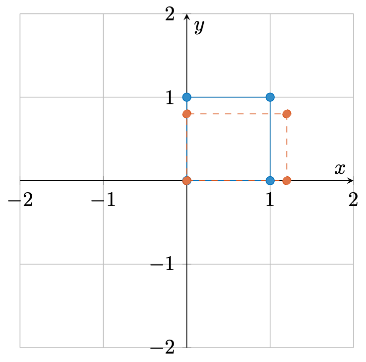
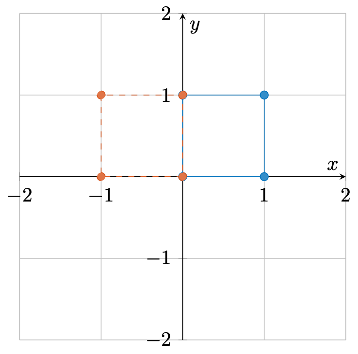
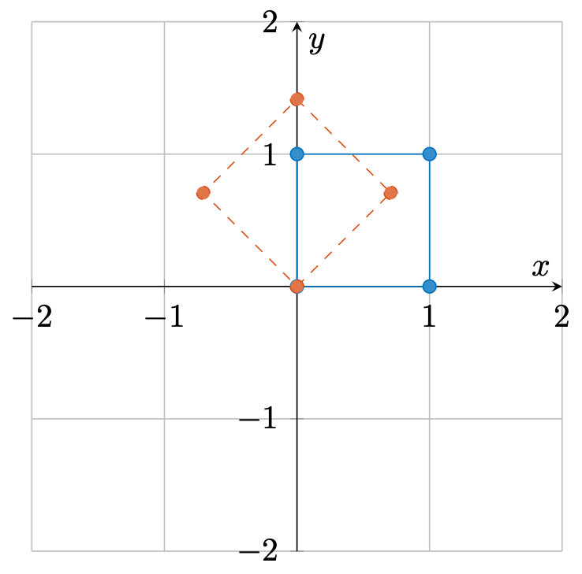
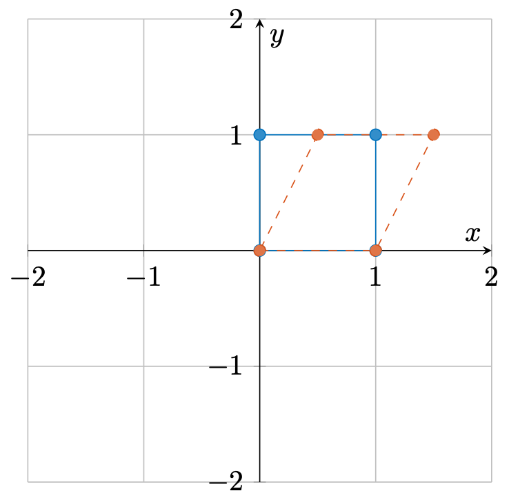

# 线性变换与矩阵乘法

在前面的章节中，我们指出矩阵 $\mathbf{X} \in \mathbb{R}^{m \times n}$ 乘一个向量 $\boldsymbol{v} \in \mathbb{R}^{n \times 1}$，可以看作是将 $\boldsymbol{v}$ 作为系数对矩阵 $\mathbf{X}$的列向量进行线性组合，得到一个新的 $m$ 维向量。在本章，我们尝试从线性变换的角度重新理解这个过程。

## 线性变换的定义

> 设 $V$ 和 $W$ 是两个线性空间，如果存在一个映射 $T: V \rightarrow W$，使得对于任意的 $x, y \in V$ 和任意的常数 $\alpha$，都有
>
> 1. 可加性：$T(x + y) = T(x) + T(y)$
>
> 1. 齐次性：$T(\alpha x) = \alpha T(x)$
>
> 那么我们称映射 $T$ 是一个**线性映射**。

如果，一个线性映射是从一个线性空间到它自身的映射，即 $T: V \rightarrow V$ ，那么我们称这个线性映射是一个**线性变换**。

对于一组基 $\mathbf{X} \in \mathbb{R}^{n \times n}$，定义如下的变换

$$
    T(\boldsymbol{v}) = \mathbf{X} \boldsymbol{v},
$$

可以验证，变换 $T$ 是一个线性变换：

> 1.  如果 $\boldsymbol{v} \in \mathbb{R}^{n \times 1}$，那么 $T(\boldsymbol{v}) = \mathbf{X} \boldsymbol{v} \in \mathbb{R}^{n \times 1}$
> 1.  可加性: $T(\boldsymbol{v}_1 + \boldsymbol{v}_2) = \mathbf{X}(\boldsymbol{v}_1 + \boldsymbol{v}_2) = \mathbf{X} \boldsymbol{v}_1 + \mathbf{X} \boldsymbol{v}_2 = T(\boldsymbol{v}_1) + T(\boldsymbol{v}_2)$
> 1.  齐次性: $T(\alpha \boldsymbol{v}) = \mathbf{X} \alpha \boldsymbol{v} = \alpha \mathbf{X} \boldsymbol{v} = \alpha T(\boldsymbol{v})$

## 二维线性变换

在这一小节，我们尝试以二维线性变换为例，从几何的角度来感受一下线性变换。根据上文的定义，我们知道一个二维的线性变换可以用一个 $2 \times 2$的矩阵来表示

$$
    \mathbf{X} = \begin{bmatrix}
        x_{11} & x_{12} \\
        x_{21} & x_{22}
    \end{bmatrix}.
$$

这个矩阵可以将一个二维向量 $\boldsymbol{v} = \begin{bmatrix} v_1 & v_2 \end{bmatrix}^{\mathrm{T}}$ 变换为另一个二维向量

$$
    \boldsymbol{v}' = \mathbf{X} \boldsymbol{v} = \begin{bmatrix}
        x_{11} v_1 + x_{12} v_2 \\
        x_{21} v_1 + x_{22} v_2
    \end{bmatrix}.
$$

于此同时，我们对于二维平面上的一些常见操作，比如旋转，缩放等等，都比较熟悉，那么这些操作如何用矩阵来表示呢？

1. 缩放

    $$
        \mathbf{X} = \begin{bmatrix}
            s_1 & 0 \\
            0 & s_2
        \end{bmatrix}.
    $$

    可以发现，变换后的向量分别在两个方向上被缩放了 $s_1, s_2$ 倍

    $$
        \boldsymbol{v}' = \mathbf{X} \boldsymbol{v} = \begin{bmatrix}
            s_1 v_1 \\
            s_2 v_2
        \end{bmatrix}.
    $$

1. 反射

    $$
        \mathbf{X} = \begin{bmatrix}
            -1 & 0 \\
            0 & 1
        \end{bmatrix}.
    $$

    此时，变换后的向量在第一个轴上被反转了

    $$
        \boldsymbol{v}' = \mathbf{X} \boldsymbol{v} = \begin{bmatrix}
            -v_1 \\
            v_2
        \end{bmatrix}.
    $$

1. 旋转

    $$
         \mathbf{X} = \begin{bmatrix}
             \cos \theta & -\sin \theta \\
             \sin \theta & \cos \theta
         \end{bmatrix}.
    $$

    该矩阵相当将向量以原点为中心旋转了 $\theta$ 度

    $$
        \boldsymbol{v}' = \mathbf{X} \boldsymbol{v} = \begin{bmatrix}
            \cos \theta v_1 - \sin \theta v_2 \\
            \sin \theta v_1 + \cos \theta v_2
        \end{bmatrix}.
    $$

1. 剪切

    $$
        \mathbf{X} = \begin{bmatrix}
            1 & 0.5 \\
            0 & 1
        \end{bmatrix}.
    $$

    此时，变换后的向量为

    $$
        \boldsymbol{v}' = \mathbf{X} \boldsymbol{v} = \begin{bmatrix}
            v_1 + 0.5v_2 \\
            v_2
        \end{bmatrix}.
    $$

    <figure style="text-align:center;margin-right:30px;">
        
        <figcaption> (a) </figcaption>
    </figure>
    <figure style="text-align:center;margin-right:30px;">
        
        <figcaption> (b) </figcaption>
    </figure>
    <figure style="text-align:center;margin-right:30px;">
        
        <figcaption> (c) </figcaption>
    </figure>
    <figure style="text-align:center;margin-right:30px;">
        
        <figcaption> (d) </figcaption>
    </figure>

    <figcaption> 常见的线性变换 (a) 缩放 (b) 反射 (c) 旋转 (d) 剪切 </figcaption>

## 线性变换的组合

两个乃至多个线性变换的组合依旧是一个线性变换吗？这里我们简单证明一下，设有两个线性变换 $T_1, T_2$ , 那么这两个线性变换的组合记作 $T = T_1 \circ T_2$, 该变换满足

$$
    T \boldsymbol{v} = (T_1 \circ T_2) \boldsymbol{v} = T_2(T_1(\boldsymbol{v})),
$$

即线性变换的组合构成的新的变换 $T$ 等价于先进行线性变换 $T_1$ 然后再进行线性变换 $T_2$。可以验证

> 1.  如果 $\boldsymbol{v} \in \mathbb{R}^{n \times 1}$，那么 $T_2(T_1(\boldsymbol{v})) \in \mathbb{R}^{n \times 1}$
> 1.  可加性: $T(\boldsymbol{v}_1 + \boldsymbol{v}_2) = T_2(T_1(\boldsymbol{v}_1 + \boldsymbol{v}_2)) = T_2(T_1(\boldsymbol{v}_1) + T_1(\boldsymbol{v}_2)) = T_2(T_1(\boldsymbol{v}_1)) + T_2(T_1(\boldsymbol{v}_2)) = T(\boldsymbol{v}_1) + T(\boldsymbol{v}_2)$
> 1.  齐次性: $T(\alpha \boldsymbol{v}) = T_2(T_1(\alpha \boldsymbol{v})) = T_2(\alpha T_1(\boldsymbol{v})) = \alpha T_2(T_1(\boldsymbol{v})) = \alpha T(\boldsymbol{v})$

因此，$T = T_1 \circ T_2$ 也是一个线性变换。设 $T_1, T_2$对应的变换矩阵分别为 $\mathbf{A}, \mathbf{B} \in \mathbb{R}^{N \times N}$，那么 $T$ 对应的矩阵该有什么表达呢？

注意到，对于线性变换 $T$ 我们有

$$
    T(\boldsymbol{v}) = T_2(T_1(\boldsymbol{v})) = \mathbf{B}(\mathbf{A} \boldsymbol{v}).
$$

令 $A_{ij}, B_{ij}$ 为矩阵 $\mathbf{A}$ 和 $\mathbf{B}$ 的第 $i$ 行，第 $j$ 列元素，则有如下等式

$$
(\mathbf{A} \boldsymbol{v})_k = \sum_{i=1}^{N} A_{ki} v_i,
$$

$$
    (\mathbf{B}(\mathbf{A} \boldsymbol{v}))_k = \sum_{j=1}^{N} B_{kj} (\mathbf{A} \boldsymbol{v})_j = \sum_{j=1}^{n} B_{kj} \sum_{i=1}^{N}  A_{ji} v_i = \sum_{i=1}^N \left(\sum_{j=1}^N B_{kj} A_{ji}\right) v_i. \tag{1}
$$

设 $T$ 对应的矩阵为 $\mathbf{C}$，则有

$$
    T(\boldsymbol{v}) =  \mathbf{C} \boldsymbol{v},
$$

变换后向量的第 $k$ 个元素有如下表达式

$$
    (\mathbf{C} \boldsymbol{v})_k = \sum_{i=1}^{N} C_{ki} v_i, \tag{2}
$$

对比式 (1) 和式 (2) 可知，变换矩阵 $\mathbf{C}$ 中的元素有如下表达式

$$
     C_{ki} = \sum_{j=1}^{N} B_{kj} A_{ji}.
$$

为了表达美观，我们可以将对应的变量进行替换，得到如下表达式

$$
    C_{ij} = \sum_{k=1}^{N} B_{ik} A_{kj}. \tag{3}
$$

我们将式 (3) 中的运算称作**矩阵乘法**，记作 $\mathbf{C} = \mathbf{B} \mathbf{A}$。

实际上，矩阵乘法可以这样计算，如 $\mathbf{C} = \mathbf{B} \mathbf{A}$，那么矩阵 $\mathbf{C}$ 的第 $i,j$ 个元素 $\mathbf{C}_{ij}$，为矩阵 $\mathbf{B}$ 的第 $i$ 行行向量 和矩阵 $\mathbf{A}$ 的第 $j$ 列列向量的内积。

此外，上文的推导都是基于方阵的（也就是行和列具有相同长度的矩阵）。对于一般的矩阵，同样可以使用矩阵乘法来计算，设有矩阵 $\mathbf{A} \in \mathbb{R}^{M \times N}, \mathbf{B} \in \mathbb{R}^{N \times L}$，那么这两个矩阵的乘积为

$$
    \mathbf{C} = \mathbf{A} \mathbf{B} \in \mathbb{R}^{M \times L}.
$$

可以看到，如果两个矩阵能够进行矩阵乘法，那么第一个矩阵的每一行都和第二个矩阵的每一列都有相同的长度。正是这样，矩阵乘法并不满足交换率，显然 $\mathbf{A} \mathbf{B}$ 能够计算并不代表 $\mathbf{B} \mathbf{A}$ 也能进行矩阵乘法。

## 小结

1. 线性变换可以用矩阵表示
2. 常见的线性变换就几何意义来说，有缩放、反射、旋转、剪切
3. 线性变换的组合可以用矩阵乘法表示
