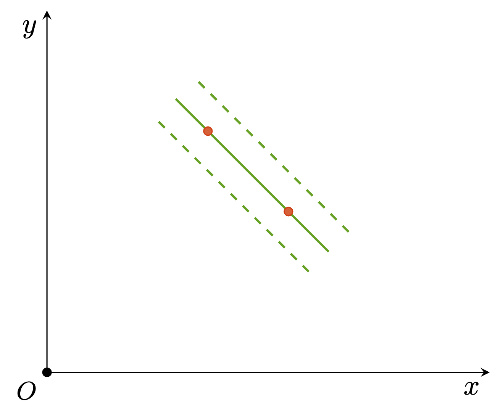

# Draw parallel lines using TiKZ

This is a simple example of how to draw parallel lines using TiKZ.

```latex
\begin{tikzpicture}[scale=1]
    \draw[thin, black, -stealth] (0, 0) -- (5.5, 0) node [below left] {$x$};
    \draw[thin, black, -stealth] (0, 0) -- (0, 4.5) node [below left] {$y$};
    \draw[black,fill] (0, 0) circle (1.5pt) node [below left] {\small $O$};

    % point 1
    \coordinate (p1) at (3, 2);
    % point 2
    \coordinate (p2) at (2, 3);

    % calculate the unit perpendicular vector
    \path let
    \n{d}={0.35cm},
    \p1=(p1),
    \p2=(p2),
    \n1={veclen(\x2-\x1,\y2-\y1)},
    \n{x}={(\y1-\y2)/\n1},
    \n{y}={(\x2-\x1)/\n1},
    in coordinate (v) at (\n{d}*\n{x}, \n{d}*\n{y});

    % draw lines
    \draw[thick, c5] ($(p1) + 0.5*($(p1)-(p2)$)$) -- ($(p2) + 0.4*($(p2)-(p1)$)$);
    \draw[thick, c5, dashed] ($(p1) + 0.5*($(p1)-(p2)$) - (v)$) -- ($(p2) + 0.4*($(p2)-(p1)$) - (v)$);
    \draw[thick, c5, dashed] ($(p1) + 0.5*($(p1)-(p2)$) + (v)$) -- ($(p2) + 0.4*($(p2)-(p1)$) + (v)$);

    \draw[c2, fill=c2!80] (p1) circle (1.5pt);
    \draw[c2, fill=c2!80] (p2) circle (1.5pt);
\end{tikzpicture}
```

Result:

<div align=center>
    
</div>
