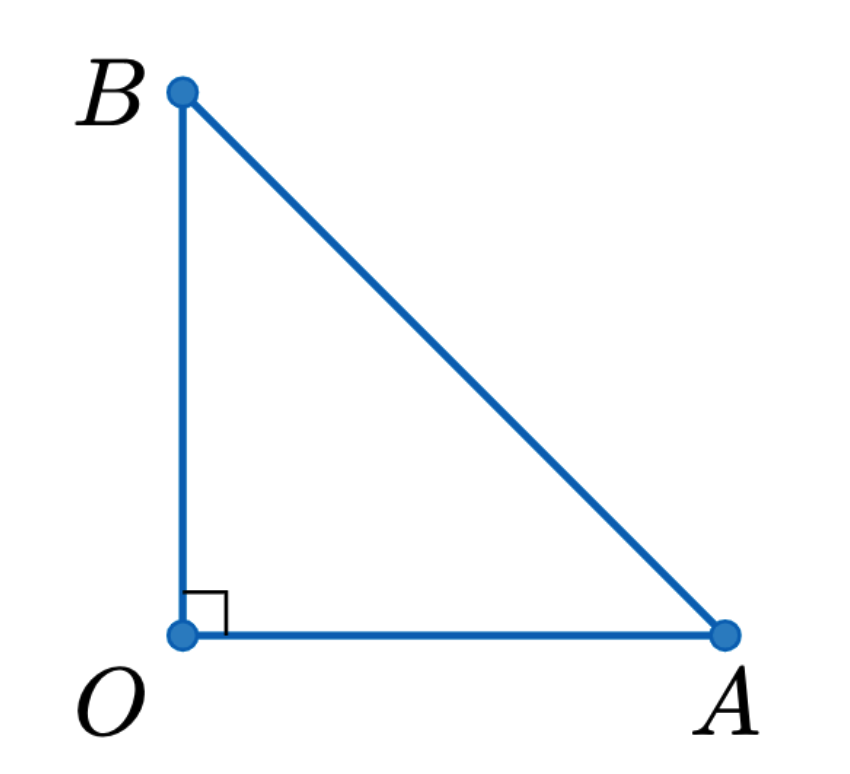

# Draw perpendicular symbol

Assume that we have three points `O`, `A`, and `B`. We want to draw a perpendicular symbol at `O` between the lines `OA` and `OB`.

```latex
\coordinate (I0) at (O);
\coordinate (I1) at (A);
\coordinate (I2) at (B);
\def\dx{0.05}
\def\dy{0.05}
\draw[thin, black] ($(I0) + \dx*($(I1) - (I0)$)$) -- ($(I0) + \dx*($(I1) - (I0)$) + \dy*($(I2) - (I0)$)$) -- ($(I0) + \dy*($(I2) - (I0)$)$);
```

Note that `\dx` and `\dy` are the parameters to adjust the size of the symbol. An example is shown below.

<div align=center>
    
</div>

```latex
\begin{tikzpicture}[scale=1]
    \coordinate (O) at (0, 0);
    \coordinate (A) at (2, 0);
    \coordinate (B) at (0, 2);
    \draw[thick,c1] (O) -- (A) -- (B) -- cycle;
    \draw[c1,fill=c1!80] (O) circle (1.5pt) (A) circle (1.5pt) (B) circle (1.5pt);
    \node[below left] at (O) {$O$};
    \node[right] at (A) {$A$};
    \node[above] at (B) {$B$};


    \coordinate (I0) at (O);
    \coordinate (I1) at (A);
    \coordinate (I2) at (B);
    \def\dx{0.08}
    \def\dy{0.08}
    \draw[thin, black] ($(I0) + \dx*($(I1) - (I0)$)$) -- ($(I0) + \dx*($(I1) - (I0)$) + \dy*($(I2) - (I0)$)$) -- ($(I0) + \dy*($(I2) - (I0)$)$);
\end{tikzpicture}
```
