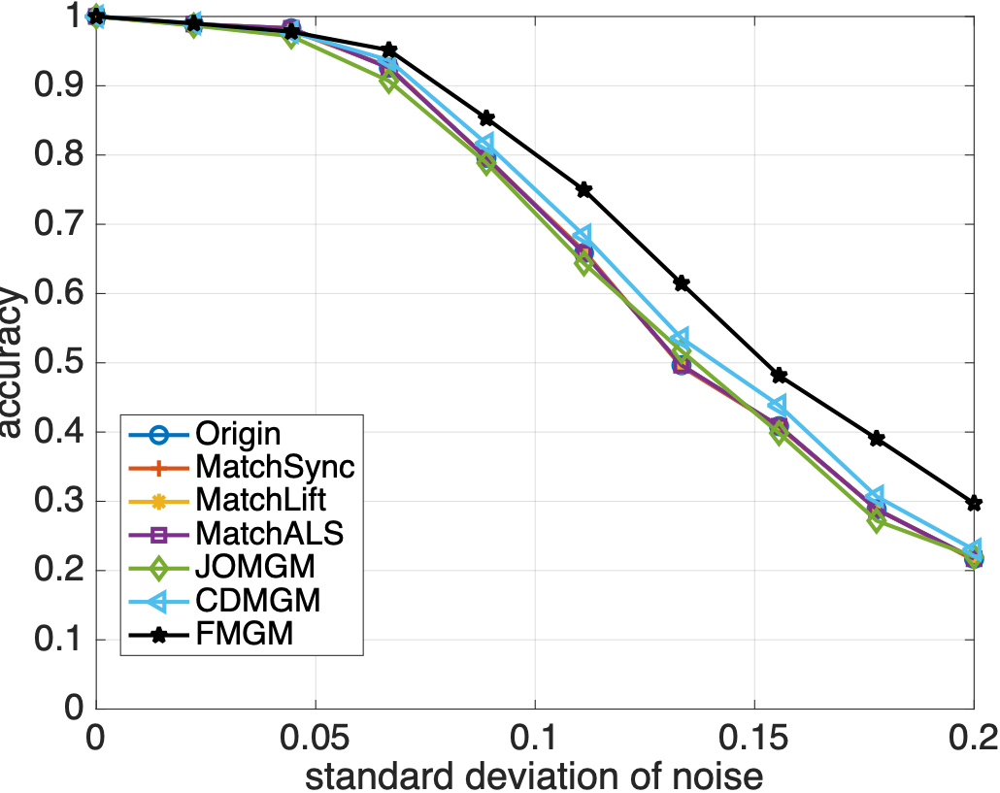
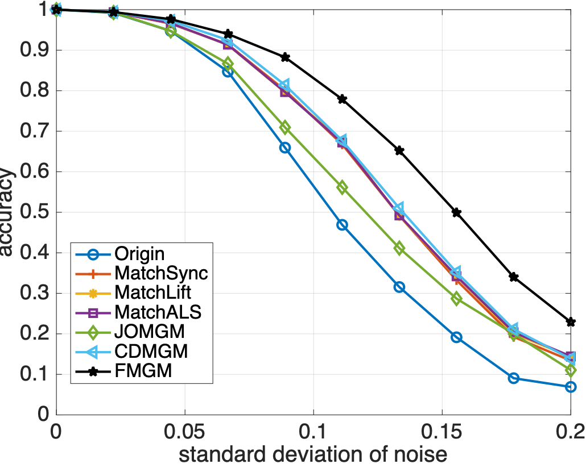
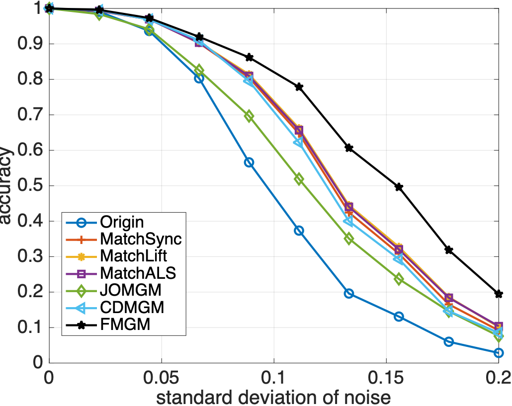
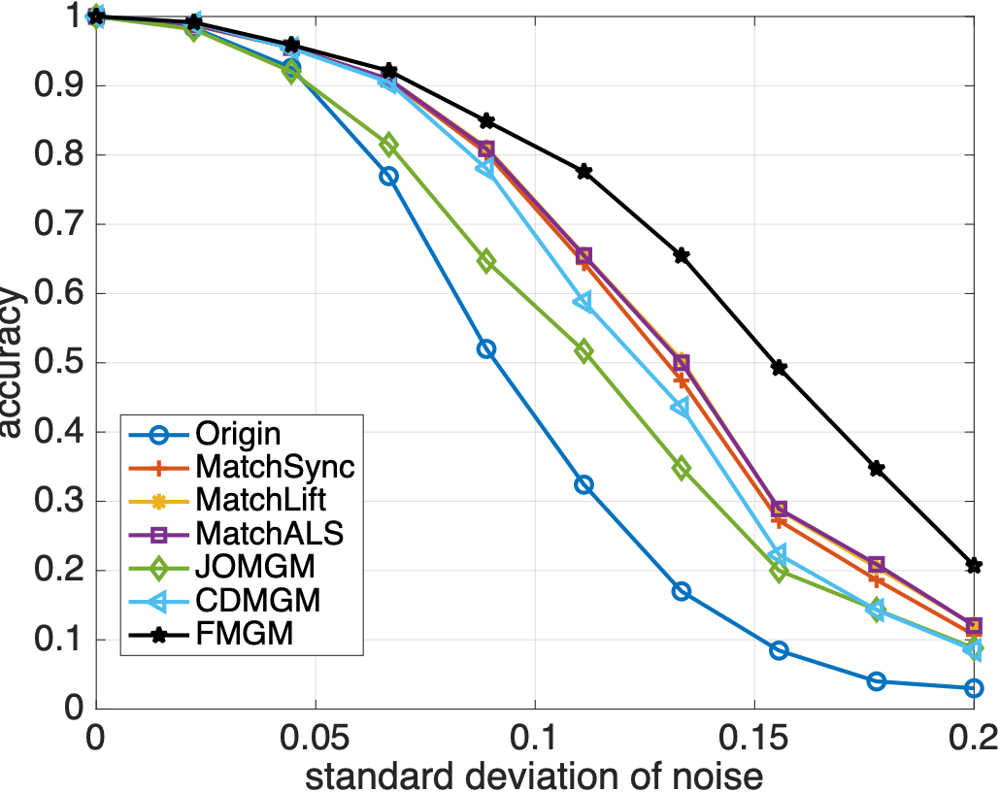
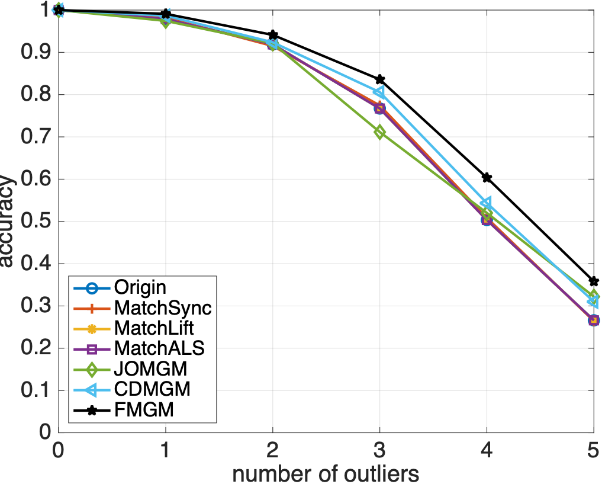
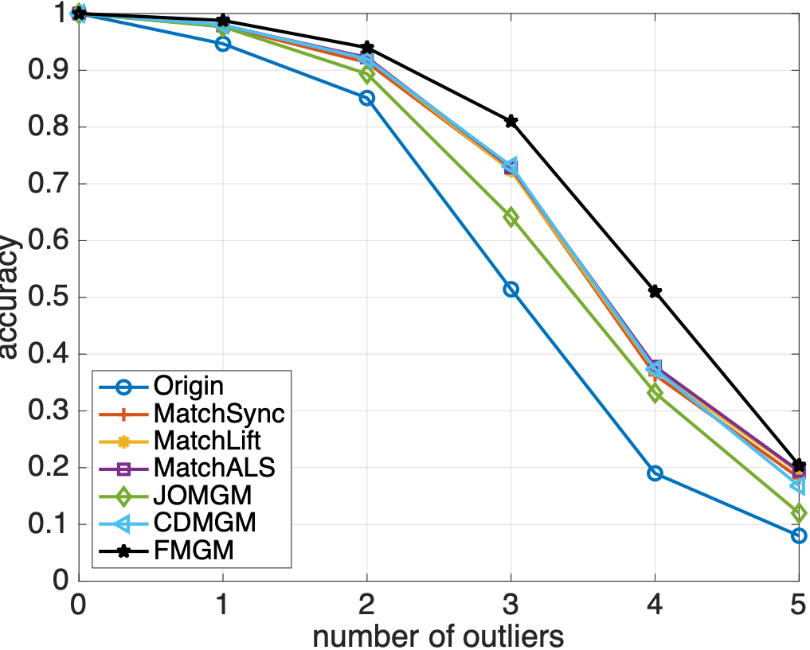
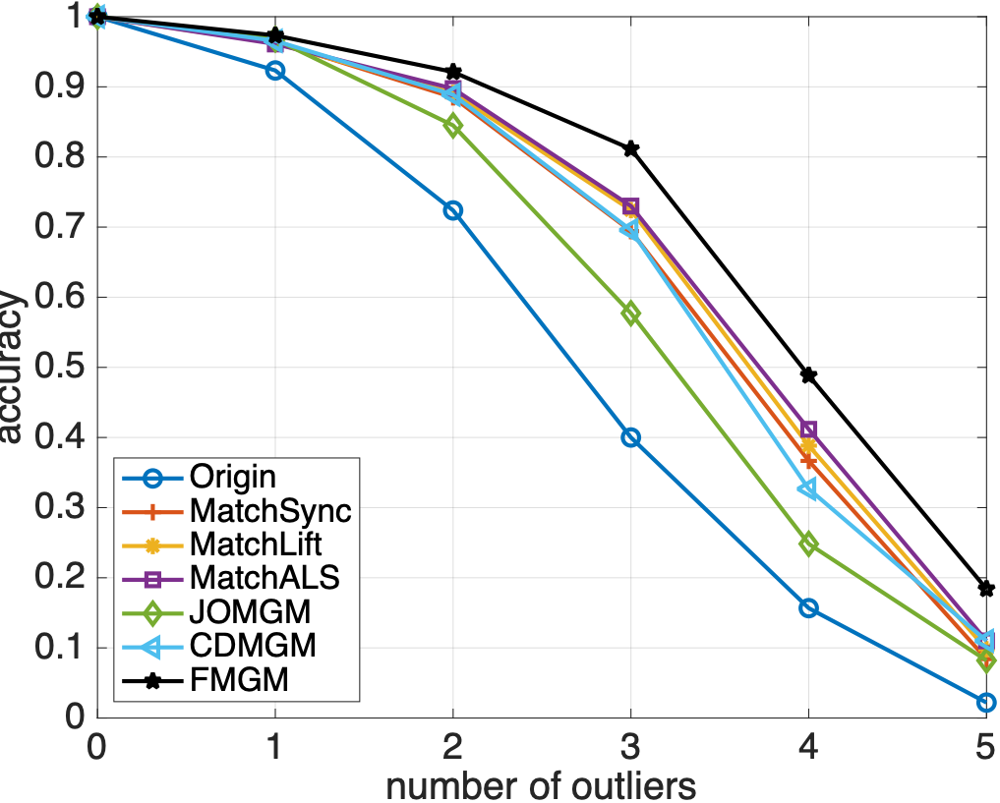
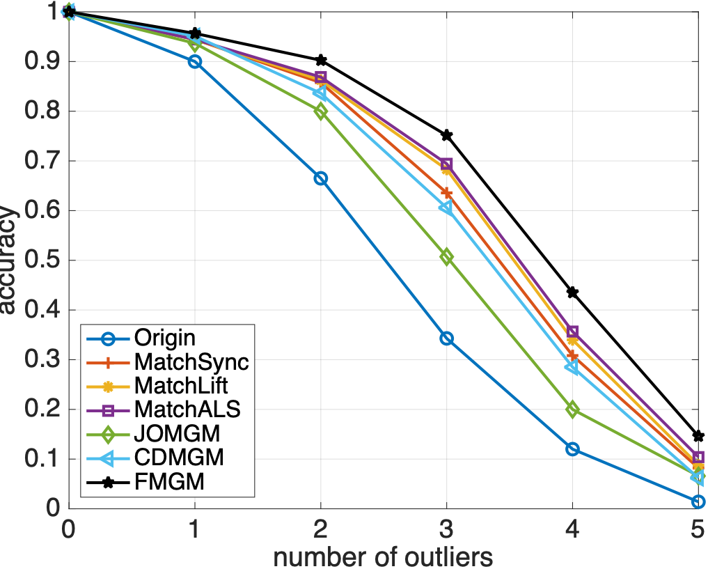

# Factorized Multigraph Matching


FMGM is a multi-graph matching method proposed in the paper [Factorized Multi-Graph Matching](https://www.sciencedirect.com/science/article/pii/S0031320323002984). It is a simple yet effective method for multi-graph matching, which is of low time and space complexity, and can avoid the cycle-consistency problem.

## Abstract

In recent years, multi-graph matching has become a popular yet challenging task in graph theory. There exist two major problems in multi-graph matching, i.e., the cycle-consistency problem, and the high time and space complexity problem. On one hand, the pairwise-based multi-graph matching methods are of low time and space complexity, but in order to keep the cycle-consistency of the matching results, they need additional constraints. Besides, the accuracy of the pairwise-based multi-graph matching is highly dependent on the selected optimization algorithms. On the other hand, the tensor-based multi-graph matching methods can avoid the cycle-consistency problem, while their time and space complexity is extremely high. In this paper, we found the equivalence between the pairwise-based and the tensor-based multi-graph matching methods under some specific circumstances. Based on this finding, we proposed a new multi-graph matching method, which not only avoids the cycle-consistency problem, but also reduces the complexity. In addition, we further improved the proposed method by introducing a lossless factorization of the affinity matrix in the multi-graph matching methods. Synthetic and real data experiments demonstrate the superiority of our method.

Fulltext of this paper can be found [here](FMGM.pdf).

## Usage

All codes of the experiments in the manuscript are included, and are written and tested in MATLAB 2022a:

-   exp_synthetic_noise.m,
-   exp_synthetic_outlier.m,
-   exp_time_cost.m,
-   exp_cmu_test.m,
-   exp_pfwillow_test.m.
-   exp_pascalvoc_test.m

Please extract all compressed files in `./data/` and run startup.m before running any code of the experiment.

The results are saved in `./results`, where there are also plotting codes.

## Synthetic Experiment Results

<div align="center">
  <div style="display: flex; justify-content: center; align-items: flex-start; gap: 20px; flex-wrap: wrap;">
    <div style="text-align: center;">
      
      (a) 
    </div>
    <div style="text-align: center;">
      
      (b) 
    </div>
    <div style="text-align: center;">
      
      (c) 
    </div>
    <div style="text-align: center;">
      
      (d) 
    </div>
  </div>
   Anti-noise performance, where number of graphs ranges from 3 to 12.
</div>

<div align="center">
  <div style="display: flex; justify-content: center; align-items: flex-start; gap: 20px; flex-wrap: wrap;">
    <div style="text-align: center;">
      
      (a) 
    </div>
    <div style="text-align: center;">
      
      (b) 
    </div>
    <div style="text-align: center;">
      
      (c) 
    </div>
    <div style="text-align: center;">
      
      (d) 
    </div>
  </div>
   Anti-outlier performance, where number of graphs ranges from 3 to 12.
</div>

## BibTex

```bibtex
@article{
    ZHU2023109597,
    title = {Factorized Multi-Graph Matching},
    journal = {Pattern Recognition},
    pages = {109597},
    year = {2023},
    issn = {0031-3203},
    doi = {https://doi.org/10.1016/j.patcog.2023.109597},
    url = {https://www.sciencedirect.com/science/article/pii/S0031320323002984}
}
```
